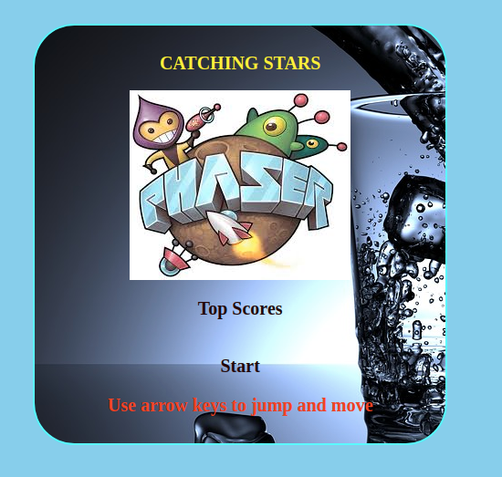
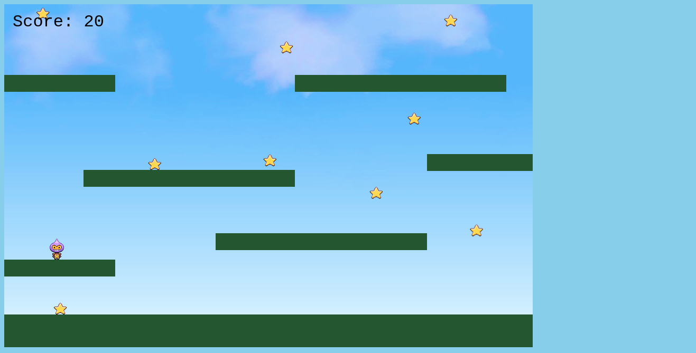

# Js-Capstone

<!--
*** Thanks for checking out this README Template. If you have a suggestion that would
*** make this better, please fork the repo and create a pull request or simply open
*** an issue with the tag "enhancement".
*** Thanks again! Now go create something AMAZING! :D
-->

<!-- PROJECT SHIELDS -->
<!--
*** I'm using markdown "reference style" links for readability.
*** Reference links are enclosed in brackets [ ] instead of parentheses ( ).
*** See the bottom of this document for the declaration of the reference variables
*** for contributors-url, forks-url, etc. This is an optional, concise syntax you may use.
*** https://www.markdownguide.org/basic-syntax/#reference-style-links
-->
[![Contributors][contributors-shield]][contributors-url]
[![Forks][forks-shield]][forks-url]
[![Stargazers][stars-shield]][stars-url]
[![Issues][issues-shield]][issues-url]

<!-- PROJECT LOGO -->
 

  

  <h3 align="center">Js-capstone</h3>

  

    This is the JavaScript capstone Project from the Javascript section of the Microverse curriculum.
     
    <a href="https://github.com/evabanegacom/Js-capstone"><strong>Explore the docs »</strong></a>
     
     
    <a href="https://github.com/evabanegacom/Js-capstone/issues">Report Bug</a>
    ·
    <a href="https://github.com/evabanegacom/Js-capstone/issues">Request Feature</a>
  

<!-- TABLE OF CONTENTS -->
## Table of Contents

* [About the Project](#about-the-project)
  * [Built With](#built-with)
* [Contact](#Authors)
* [Acknowledgements](#acknowledgements)
* [How it works](#How-it-works)
* [How to play](#How-to-play)
* [Game design](#Game-Design)

<!-- ABOUT THE PROJECT -->
## About The Project

This is a Js-capstone that demonstrates using Phaser LIbrary to  make a platform Game, it uses API methods to store and fetch the leader board data
to clients over the web

## LIVE DEMO
 [Link to live demo](https://raw.githack.com/evabanegacom/Js-capstone/feature/dist/index.html) 

<!-- BUILD WITH -->
## Built With
This project was built using these technologies.
* Javascript
* HTML
* CSS
* webpack

<!-- ABOUT THE PROJECT -->
## Getting Started
- To get a local copy up and running follow these simple example steps.

#### Clone the repository to run the app.

- $ `git clone git@github.com:evabanegacom/Js-capstone.git`

## How to play

* When the game first starts;

* Click play to start the game.
* To play, all you need to do is user your arrow keys to jump and move.
* collet the stars and avoid the jumping explosives the stars earn you points
* colliding with the stars ends the game and
* A dialogue box shows up requesting you to enter your name.
* After you enter your name and click submit, it takes you to another screen with two buttons, play and credits.

# Game design

The game uses a number of sprites to bring all the scenes to life. User can expect well-designed animations and map textures. Some of the sprites used include;

# Jumper

* moving character
* jumps on platforms
* avoids explosives
* collects stars

<!-- CONTACT -->

👤 **Precious**

- Github: [@Precious](https://github.com/evabanegacom)

<!-- ACKNOWLEDGEMENTS -->
## Acknowledgements
* [Microverse](https://www.microverse.org/)

## Show your support

Give a ⭐️ if you like this project!

<!-- MARKDOWN LINKS & IMAGES -->
<!-- https://www.markdownguide.org/basic-syntax/#reference-style-links -->
[contributors-shield]: https://img.shields.io/github/contributors/evabanegacom/Js-capstone.svg?style=flat-square
[contributors-url]: https://github.com/evabanegacom/Js-capstone/graphs/contributors
[forks-shield]: https://img.shields.io/github/forks/evabanegacom/Js-capstone.svg?style=flat-square
[forks-url]: https://github.com/evabanegacom/Js-capstone/network/members
[stars-shield]: https://img.shields.io/github/stars/evabanegacom/Js-capstone.svg?style=flat-square
[stars-url]: https://github.com/evabanegacom/Js-capstone/stargazers
[issues-shield]: https://img.shields.io/github/issues/evabanegacom/Js-capstone.svg?style=flat-square
[issues-url]: https://github.com/evabanegacom/Js-capstone/issues

## 📝 License

This project is [MIT](https://opensource.org/licenses/MIT) licensed. Design by Gregoire Vella on Behance.